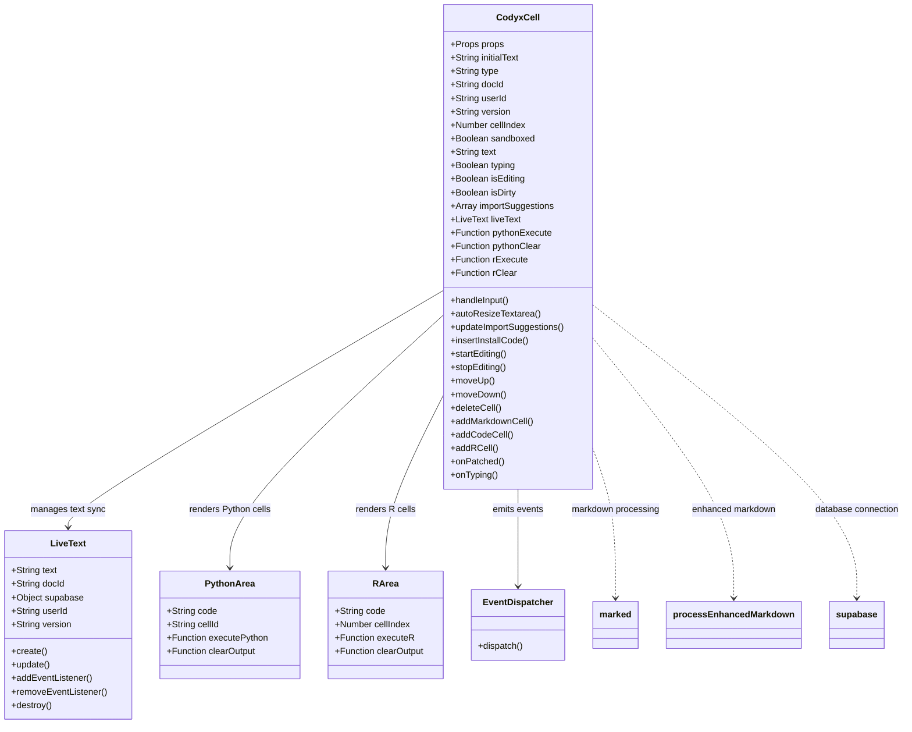
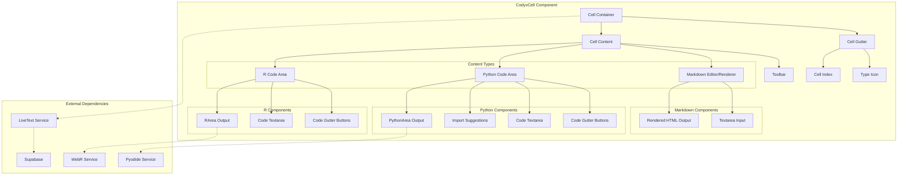
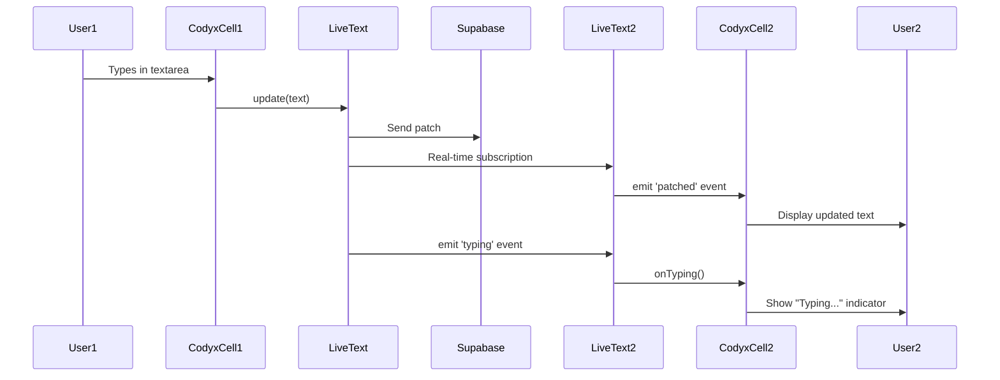

# CodyxCell Component Documentation

## Overview

`CodyxCell.svelte` is the core component of the CODYX notebook system, responsible for rendering and managing individual cells in a collaborative notebook. It supports three types of cells: Markdown (`md`), Python code (`code`), and R code (`r`). The component provides real-time collaboration features, code execution capabilities, and an interactive editing experience.

## Component Architecture



## Component Diagram



## Properties (Props)

| Property | Type | Default | Description |
|----------|------|---------|-------------|
| `initialText` | String | `''` | Initial content of the cell |
| `type` | String | `'md'` | Cell type: `'md'` (markdown), `'code'` (Python), or `'r'` (R) |
| `docId` | String | `crypto.randomUUID()` | Unique identifier for the cell |
| `userId` | String | `null` | User identifier for collaboration features |
| `version` | String | - | Version/timestamp for conflict resolution |
| `cellIndex` | Number | `1` | Display index of the cell in the notebook |
| `sandboxed` | Boolean | `false` | Whether the cell is in read-only sandbox mode |

## State Variables

### Text and Editing State
- **`text`**: Current cell content (reactive state)
- **`typing`**: Boolean indicating if another user is typing
- **`isEditing`**: Boolean for markdown edit mode
- **`isDirty`**: Boolean tracking unsaved changes

### Execution Bindings
- **`pythonExecute`**: Function reference to execute Python code
- **`pythonClear`**: Function reference to clear Python output
- **`rExecute`**: Function reference to execute R code
- **`rClear`**: Function reference to clear R output

### UI State
- **`importSuggestions`**: Array of detected Python import suggestions
- **`textareaElement`**: Reference to the textarea DOM element

### Collaboration
- **`liveText`**: LiveText instance for real-time synchronization
- **`liveTextUpdater`**: Function to update LiveText on changes

## Methods

### Input Handling

#### `handleInput(event)`
Handles textarea input events, updates LiveText, auto-resizes textareas, and triggers import suggestions for Python cells.

#### `autoResizeTextarea(textarea)`
Automatically adjusts textarea height based on content, with min/max constraints:
- Minimum: 60px (~3 lines)
- Maximum: 400px for markdown, 800px for code cells

### Import Management (Python)

#### `updateImportSuggestions()`
Analyzes Python code to detect import statements and suggests micropip installations for available Pyodide packages.

**Detection patterns:**
- `import package`
- `from package import ...`
- `import package1, package2`

#### `insertInstallCode(suggestion)`
Inserts micropip installation code before the import statement:
```python
import micropip
await micropip.install('package-name')
```

### Editing Operations

#### `startEditing()`
Activates edit mode for markdown cells (not available in sandbox mode).

#### `stopEditing()`
Deactivates edit mode and dispatches 'edit' event with updated text.

### Cell Operations

#### `moveUp()`
Dispatches 'moveUp' event to reorder cell upward in notebook.

#### `moveDown()`
Dispatches 'moveDown' event to reorder cell downward in notebook.

#### `deleteCell()`
Dispatches 'delete' event to remove cell from notebook.

#### `addMarkdownCell()`
Dispatches 'addCell' event to insert new markdown cell.

#### `addCodeCell()`
Dispatches 'addCell' event to insert new Python code cell.

#### `addRCell()`
Dispatches 'addCell' event to insert new R code cell.

### Collaboration Handlers

#### `onPatched(event)`
Handles incoming text patches from other users via LiveText.

#### `onTyping(event)`
Updates typing indicator when other users are editing.

## Events

The component dispatches the following events to its parent:

| Event | Payload | Description |
|-------|---------|-------------|
| `edit` | `{ type, docId, text }` | Cell content was edited |
| `moveUp` | `{ docId }` | Request to move cell up |
| `moveDown` | `{ docId }` | Request to move cell down |
| `delete` | `{ docId }` | Request to delete cell |
| `addCell` | `{ docId, cellType }` | Request to add new cell |

## Lifecycle

### `onMount()`
1. Creates LiveText instance for real-time collaboration
2. Registers event listeners for 'patched' and 'typing' events
3. Injects collapsible markdown functionality script
4. Triggers import suggestions for Python cells
5. Auto-resizes textarea if it has initial content

### `onDestroy()`
1. Removes LiveText event listeners
2. Destroys LiveText instance (if not sandboxed)

## Dependencies

### External Libraries
- **`svelte`**: Core framework (onMount, onDestroy, createEventDispatcher)
- **`marked`**: Markdown to HTML conversion
- **`$lib/classes/live-text.js`**: Real-time text synchronization
- **`$lib/util/supabase-client.js`**: Database connection
- **`$lib/util/enhanced-markdown.js`**: Enhanced markdown processing

### Child Components
- **`PythonArea`**: Python code execution and output rendering
- **`RArea`**: R code execution and output rendering

### Data Files
- **`pyodide-packages.json`**: List of available Pyodide packages for import suggestions

## Cell Types

### Markdown Cell (`type='md'`)
- Editable textarea with click-to-edit functionality
- Live preview of rendered markdown
- Support for enhanced markdown features (collapsible sections, etc.)
- KaTeX math rendering support

### Python Code Cell (`type='code'`)
- Syntax-highlighted code editor
- Run/Clear buttons in gutter
- Automatic import detection and micropip suggestions
- Integration with Pyodide for browser-based execution
- Auto-resizing textarea (max 800px)

### R Code Cell (`type='r'`)
- Syntax-highlighted code editor
- Run/Clear buttons in gutter
- Integration with WebR for browser-based execution
- Auto-resizing textarea (max 800px)
- Support for plots and graphics output

## Toolbar Actions

Available in non-sandboxed mode:
- **Move Up/Down**: Reorder cells
- **Add Markdown Cell**: Insert new markdown cell
- **Add Python Cell**: Insert new Python code cell
- **Add R Cell**: Insert new R code cell
- **Delete**: Remove current cell

## Package Mapping

The component maintains a mapping of Python import names to Pyodide package names:

```javascript
const specialMappings = {
    'sklearn': 'scikit-learn',
    'cv2': 'opencv-python',
    'PIL': 'Pillow',
    'bs4': 'beautifulsoup4',
    'yaml': 'pyyaml',
    'Image': 'Pillow',
    'requests': 'requests'
};
```

## Styling

The component uses scoped CSS with:
- Custom fonts: Raleway (body), Cutive Mono (code), Material Symbols (icons)
- Responsive design with flexbox layout
- Custom cell type icons (R symbol, Python symbol, markdown icon)
- Syntax highlighting for code blocks
- KaTeX integration for mathematical expressions
- Collapsible section support in markdown

## Accessibility

- Keyboard navigation support (Enter to edit markdown)
- ARIA live region for typing indicator
- Semantic HTML with proper roles and tabindex
- Focus management for interactive elements

## Usage Example

```svelte
<CodyxCell 
    initialText="# Hello World"
    type="md"
    docId="unique-cell-id"
    userId="user-123"
    version="2024-01-01T00:00:00Z"
    cellIndex={1}
    sandboxed={false}
    on:edit={(e) => handleEdit(e)}
    on:moveUp={(e) => handleMoveUp(e)}
    on:moveDown={(e) => handleMoveDown(e)}
    on:addCell={(e) => handleAddCell(e)}
    on:delete={(e) => handleDelete(e)}
/>
```

## Real-time Collaboration Flow



## Performance Considerations

1. **Auto-resize throttling**: Uses `setTimeout` to defer resize operations
2. **Import detection**: Only runs on Python code cells, not markdown or R
3. **Reactive effects**: Minimal $effect usage to avoid unnecessary re-renders
4. **DOM manipulation**: Direct textarea manipulation for performance
5. **Event delegation**: Single event handlers for multiple toolbar buttons

## Security

- Read-only sandbox mode prevents editing and cell operations
- No direct code execution in component (delegated to PythonArea/RArea)
- Input sanitization through marked and enhanced markdown processors
- Supabase RLS policies control data access

## Future Enhancements

Potential areas for improvement:
- Add code syntax highlighting in textarea
- Support for cell folding/collapsing
- Inline execution results for single-line expressions
- Cell execution queue management
- Cell output caching
- Collaborative cursors showing other users' positions
